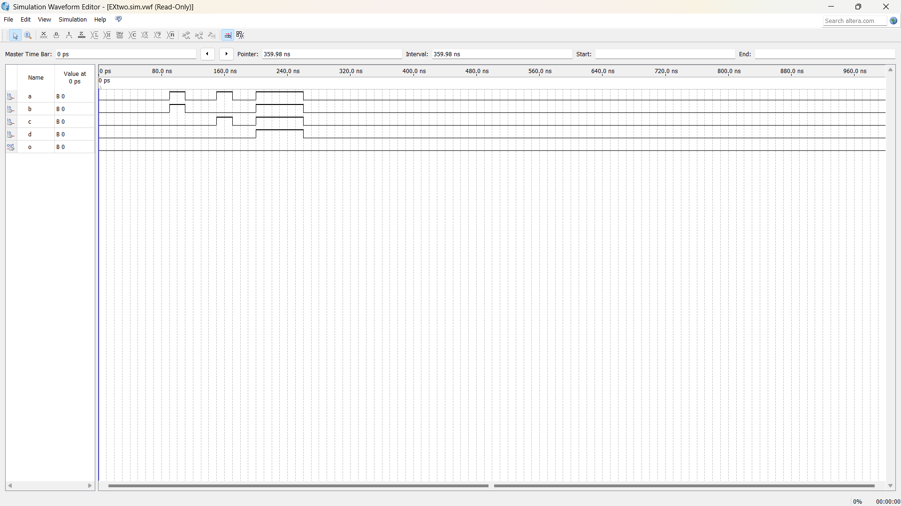
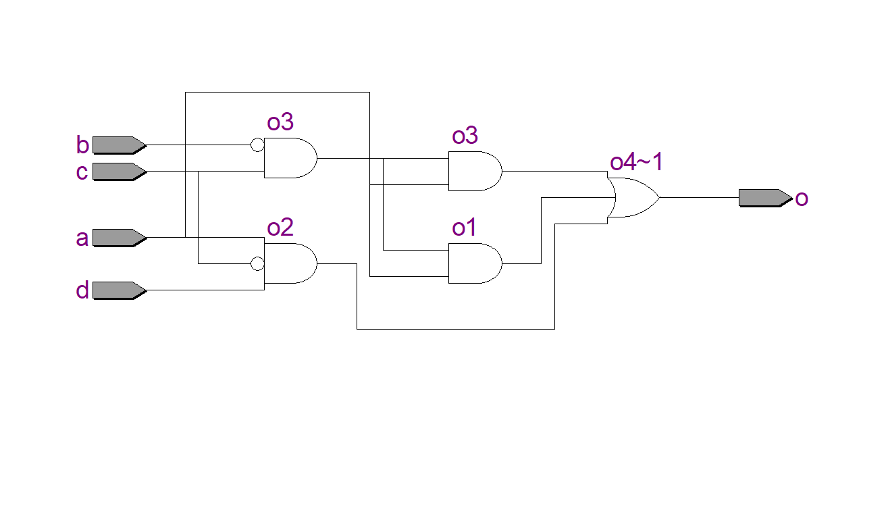
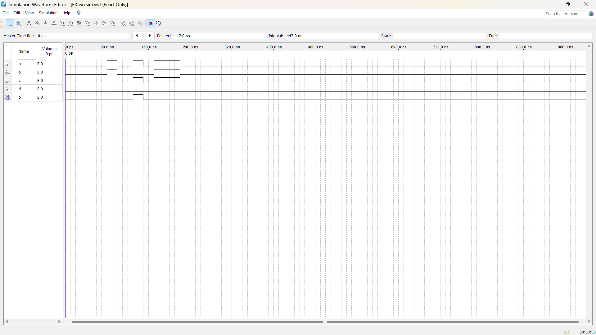

# Experiment--02-Implementation-of-combinational-logic
Implementation of combinational logic gates
 
## AIM:
To implement the given logic function verify its operation in Quartus using Verilog programming.
F1= A’B’C’D’+AC’D’+B’CD’+A’BCD+BC’D
F2=xy’z+x’y’z+w’xy+wx’y+wxy

## Equipments Required:

### Hardware – PCs, Cyclone II , USB flasher
### Software – Quartus prime

## Theory
 Logic gates are electronic circuits which perform logical functions on one or more inputs to produce one output.

### Using NAND gates
NAND gate is actually a combination of two logic gates i.e. AND gate followed by NOT gate. So its output is complement of the output of an AND gate.This gate can have minimum two inputs, output is always one. By using only NAND gates, we can realize all logic functions: AND, OR, NOT, X-OR, X-NOR, NOR. So this gate is also called as universal gate. First note that the entire expression is inverted and we have three terms ANDed. This means that we must use a 3-input NAND gate. Each of the three terms is, itself, a NAND expression. Finally, negated single terms can be generates with a 2-input NAND gate acting as an inverted.

F=((C'.B.A)'(D'.C.A)'(C.B'.A)')'

### Logic Diagram
Using NOR gates NOR gate is actually a combination of two logic gates: OR gate followed by NOT gate. So its output is complement of the output of an OR gate. This gate can have minimum two inputs, output is always one. By using only NOR gates, we can realize all logic functions: AND, OR, NOT, Ex-OR, Ex-NOR, NAND. So this gate is also called universal gate. Designing a circuit with NOR gates only uses the same basic techniques as designing a circuit with NAND gates; that is, the application of deMorgan’s theorem. The only difference between NOR gate design and NAND gate design is that the former must eliminate product terms and the later must eliminate sum terms.

F=(((C.B'.A)+(D.C'.A)+(C.B'.A))')'
## Procedure
## Program:
/*
Program to implement the given logic function and to verify its operations in quartus using Verilog programming.
Developed by: Shakthi kumar S
RegisterNumber: 212222110043
*/
### NAND GATE:
module EXtwo(a,b,c,d,o);
input a,b,c,d;
output o;
wire o1,o2,o3;
assign o1 = (~c&~b&~a);
assign o2 = (~d&~c&~a);
assign o3 = (c&~(~b)&~a);
assign o= o1&~o2&~o3;
endmodule

### NOR GATE
module EXtwo(a,b,c,d,o);
input a,b,c,d;
output o;
wire o1,o2,o3,o4;
assign o1 = c&(~b)&a;
assign o2 = d&(~c)&a;
assign o3 = c&(~b)&a;
assign o4 = ~(o1|o2|o3);
not(o,o4);
endmodule

## Output:
## RTL
### NAND GATE:

### NOR GATE:

## Timing Diagram
### NAND GATE:

### NOR GATE:

## Result:
Thus the given logic functions are implemented using  and their operations are verified using Verilog programming.
